**Name of Team:** FlockShare

**Team Members:** Anjali Gupta, Nadia Lara, Janani Rao, Michelle Flores 

**Description:** Our mobile app seeks to reduce food waste at Stevens by allowing students to give and recieve food that would have been wasted. A user can upload an image or use their camera to take upload an item and corresponding users can claim those items and will recieve a confirmation QR code.  

**Technologies:** Swift, XCode, Replit, Github, Canva, PowerPoint, GenAI

**Relevant Information:** We have a corresponding slideshow presentation to discuss our ideas and thoughts behind our project.

**Presentation Script:** 

  Title Slide:
  Good morning, everyone! We’re excited to introduce you to Flock Share, our solution to reducing food waste and tackling food insecurity on college campuses.
  
 **Objective**
  Every year, about 60 million tons of food is wasted in the U.S., and college campuses contribute significantly to this issue. Students often purchase food but struggle to finish it before it goes bad. At the same time, many students experience food insecurity, unsure of where their next meal will come from. Flock Share was created to bridge this gap. It provides an easy way for students to share their extra food with others who need it, fostering a culture of sustainability and community support on college campuses.
  
**How FlockShare Works**

1. User opens app and is prompted to register or sign in
   
    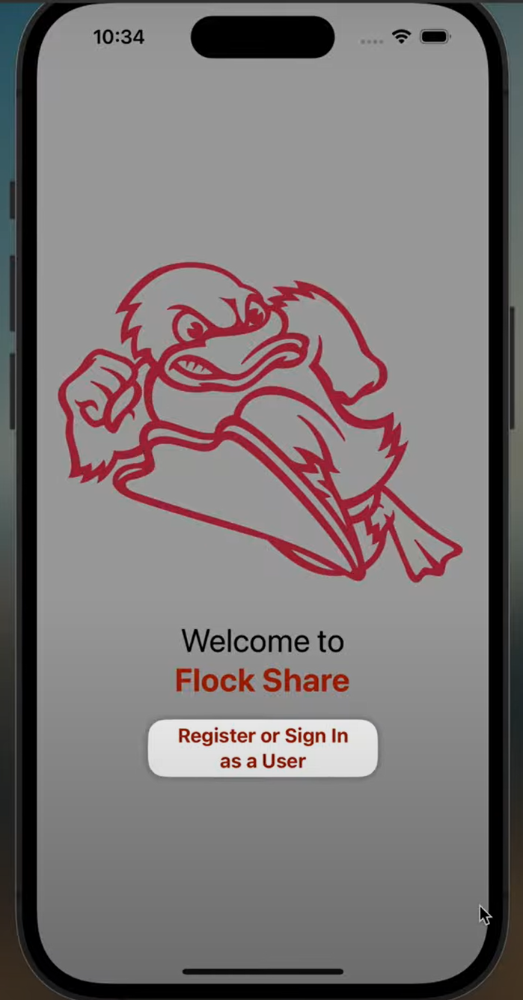

2. User can select either option on the second page
   
   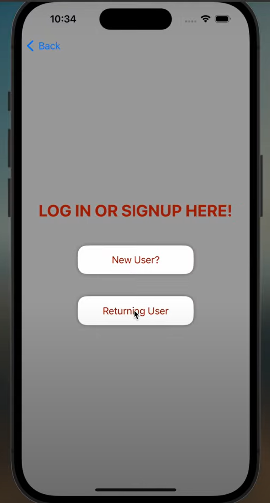
   
3. If the user selects ReturningUser they will be prompted to input their credentials

   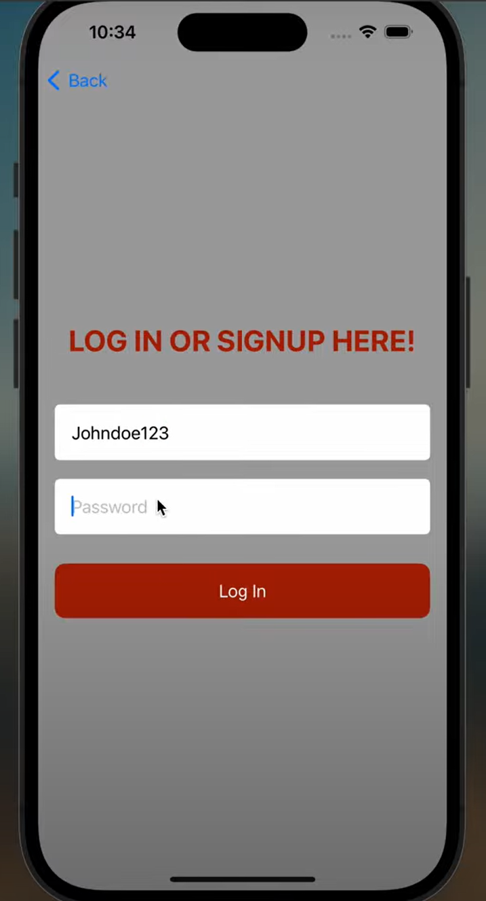

3. The user is then prompted to enter their zipcode which allows the app to determine location. Once locaiton is determined the user can choose to either give food or receive food.

   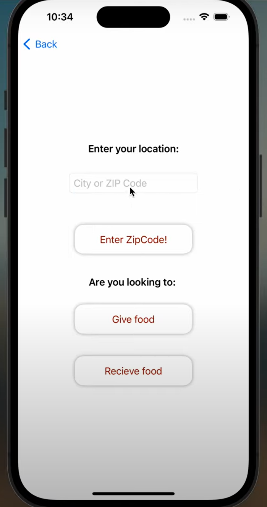

5. Giving Food
   - The user is able to choose whether they would like to select a photo from their gallery or take a picture of their item.
     
   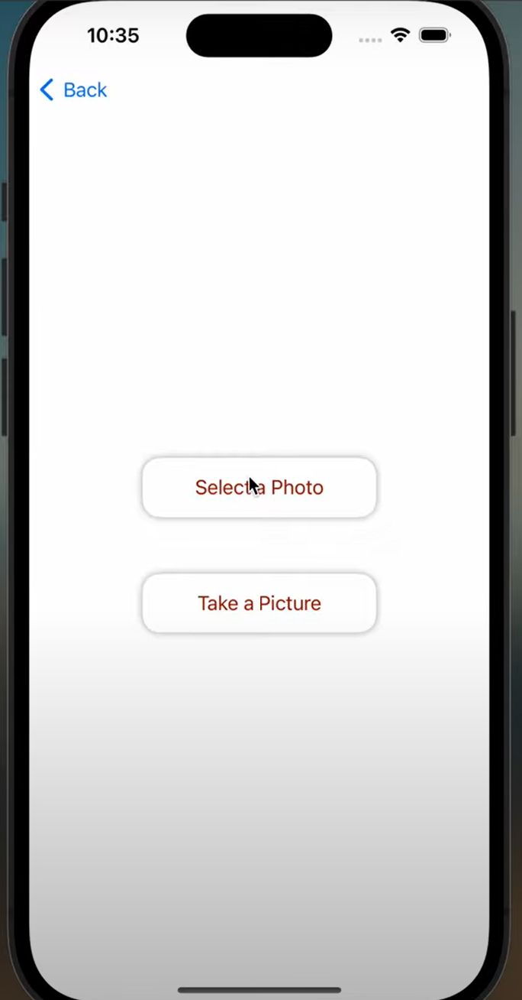

   - If they choose a photo form their gallery they can select a photo
     
   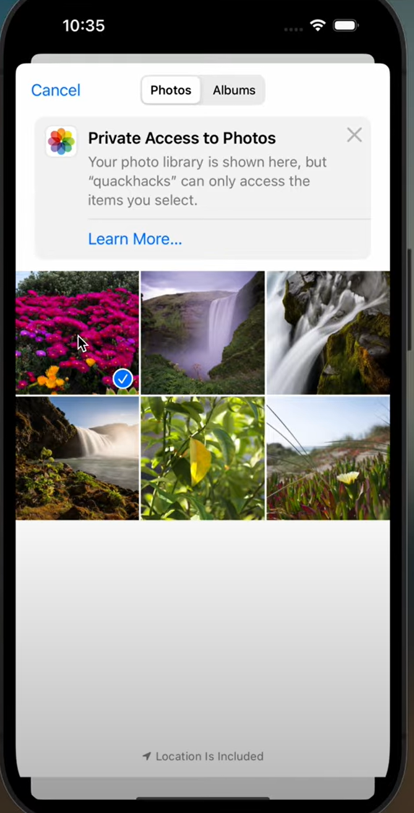

   - Then input a description of their item
   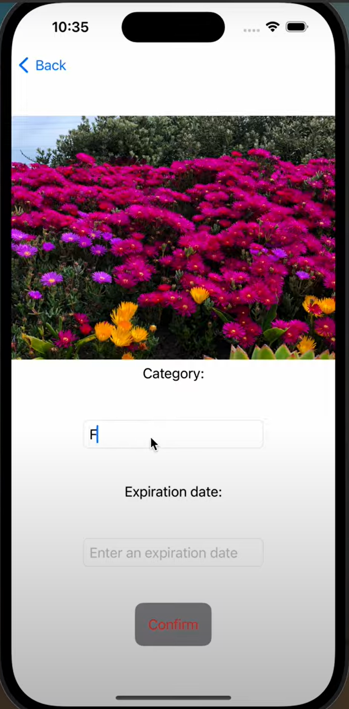
   
   -  Once a picture is submitted they have been successfully been able to donate
     
   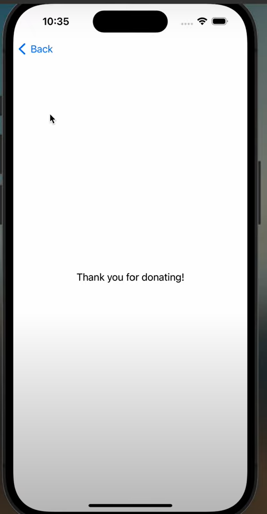

6. Receving Food
   - The user can choose from a selection of grocery departments.
     
   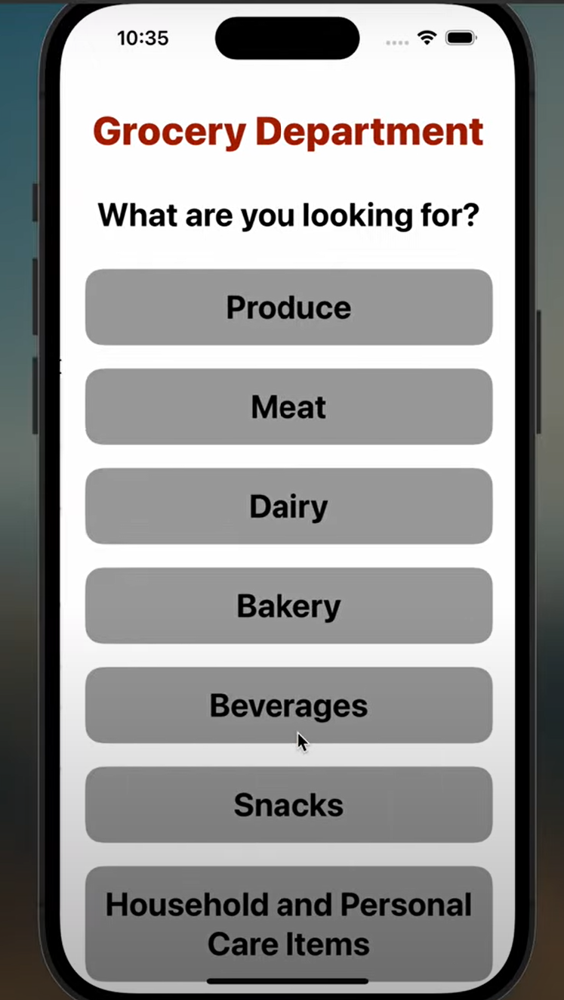
   
   - Once a selection is made the user can see a list of items that is sorted by distance.
     
   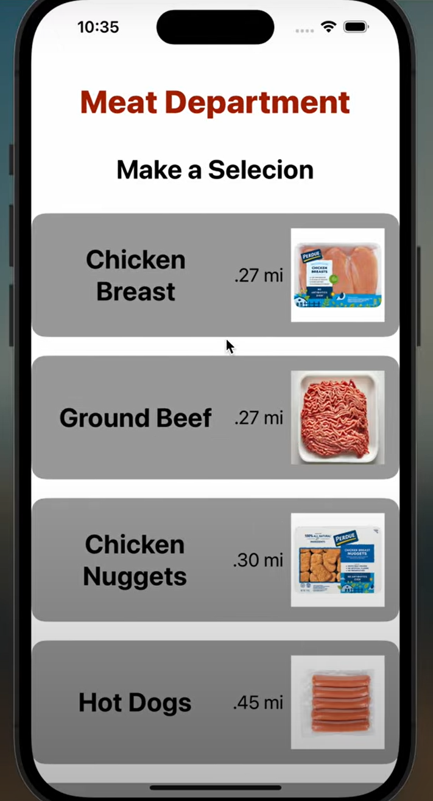
   
   - After making a selection the user must confirm their selection.

      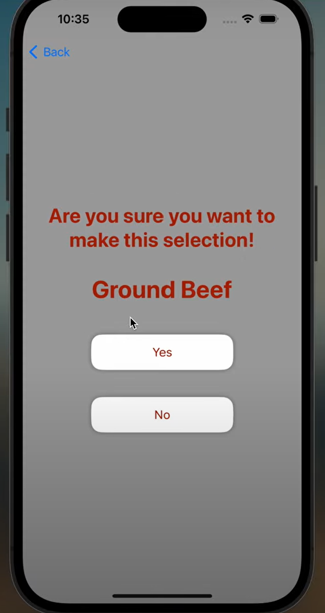
      
   - Once confirmation is given they will be shown a QR code which will allow the user to retrieve their item.
  
      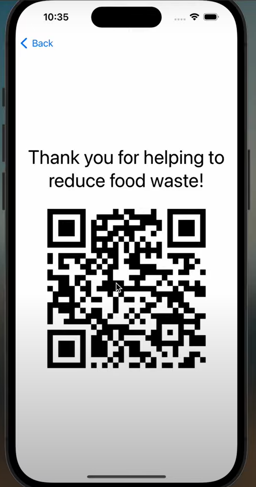

  
  
**Updates**

 Since we only had 24 hours, we prioritized making the app functional and intuitive, laying the groundwork for future development. If Flock Share were to be fully implemented, there are a few exciting next steps:
  First, we would like to integrate the locker system to provide a secure, contactless pickup method for students to access food safely. Next, we want to implement a rewards system so every time a student shares or picks up food, they earn ducks. For every five ducks, they get $1 in DuckBills which is our campus currency. Stevens is one of the few schools without a dedicated food pantry. While Flock Share isn’t a pantry, it provides an immediate, community-driven solution to food insecurity by connecting students who have extra food with those who need it.
  
  
  Flock Share isn’t just about reducing food waste—it’s about building a community that looks out for one another. At the heart of it all, our goal is simple: Flock Share – A community that shares, cares. Thank you!
  
  
  
